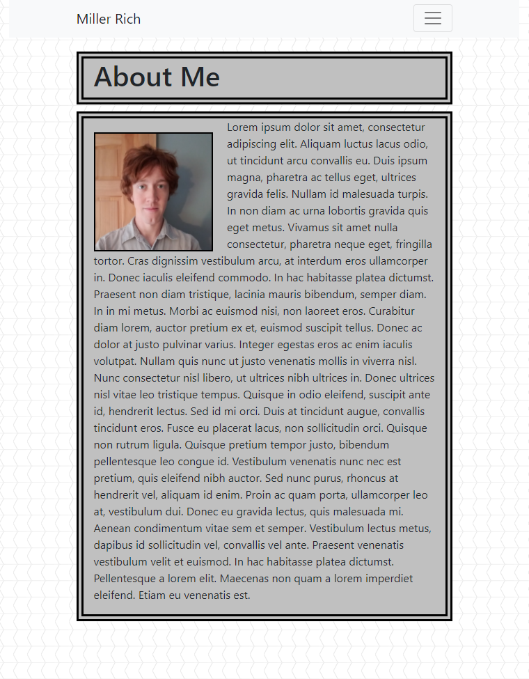
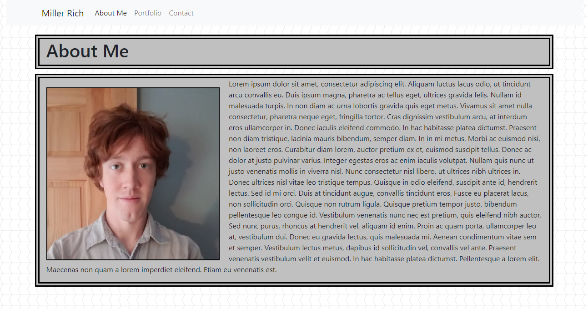

# Responsive Portfolio

## Description
This is a mobile-first portfolio website, meaning it is designed with mobile-viewing first in mind.  
The site is meant to be a portfolio containing three sections:  
* About Me
* Portfolio
* Contact

This site is built using bootstrap and designed to be responsive,  
images and boxes will resize according to the browser they are viewed in.  
The site will automatically resize itself to fit either mobile or desktop browsers.  
Additionally, you will notice a different navbar menu when viewing  
on mobile and desktop browsers.

## Samples of Website Responsivity
The first image shows an example of the website viewed in a smaller browser window,  
notice the hamburger menu.

The second image shows an example of the website viewed in a larger browser window,  
notice a text menu appears in the navbar

Additionally, you will notice that the image and text move and resize themselves in response to a change in browser size.